# CEM-ERL Benchmark

## Pendulum-v1 results 

### First is computed on 500k steps, 2nd is computed on 900k steps, Results are not the same because of random picking of CEM agent in RL agent insertion and hyperparameters different

Using `CEM_ERL/benchmark/2022-03-20`:

#### elites_reward false, represents lowest part of the population
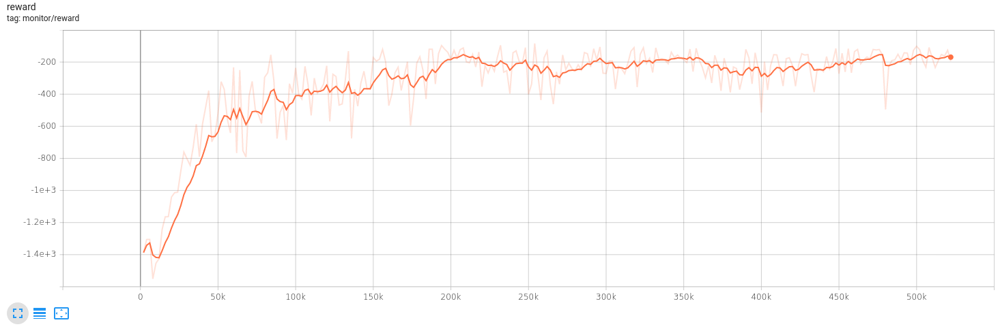
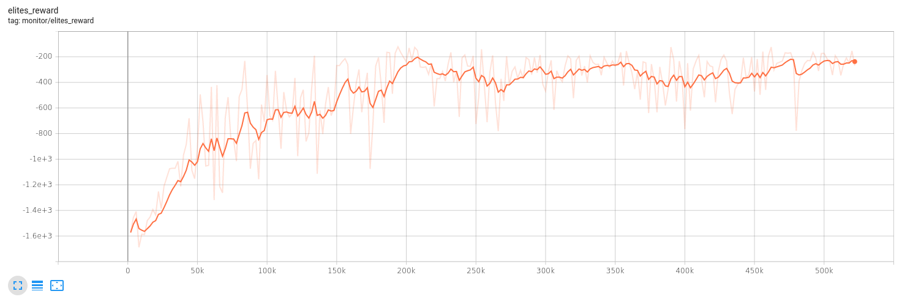
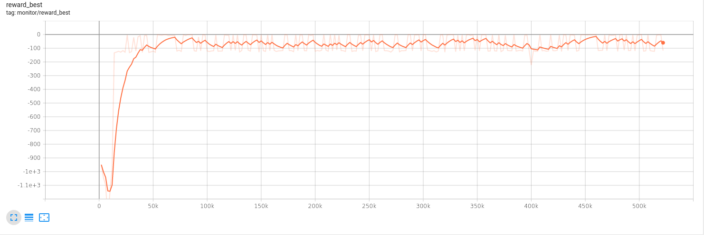
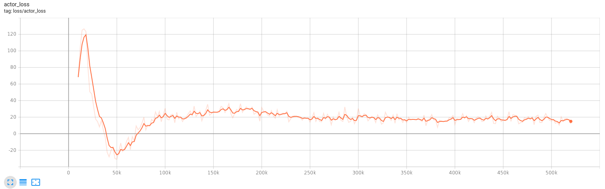
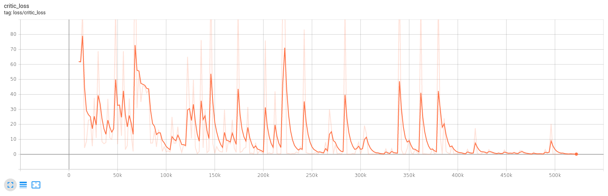
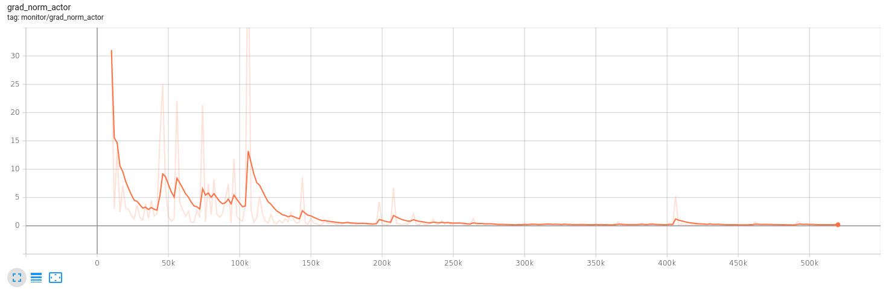
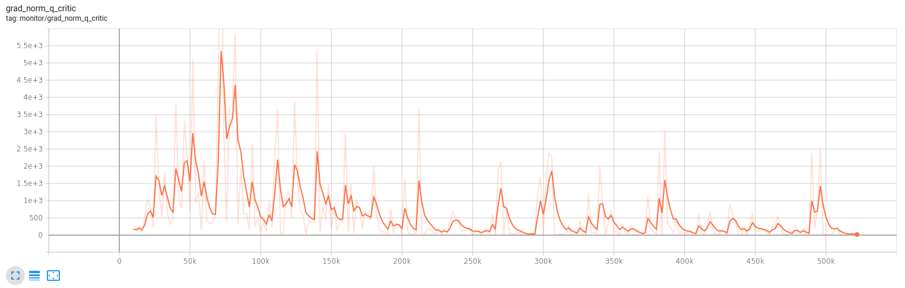

Using `CEM_ERL/benchmark/2022-03-21`:

#### yaml parameters different :
* algorithm.n_processes : 2 <- 8
* algorithm.n_envs : 1 <- 2
* algorithm.buffer_size : 100000 <- 1000000

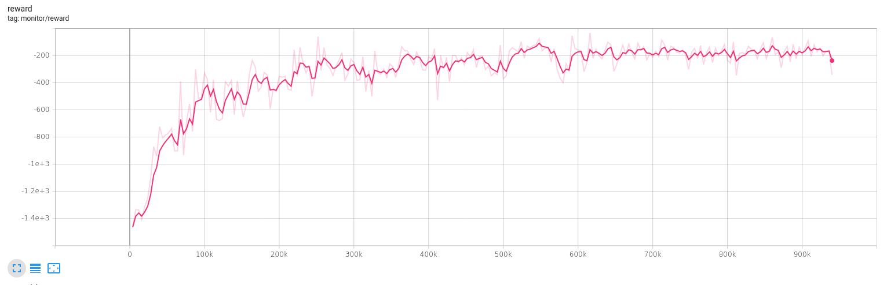
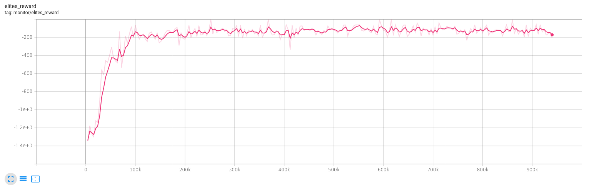
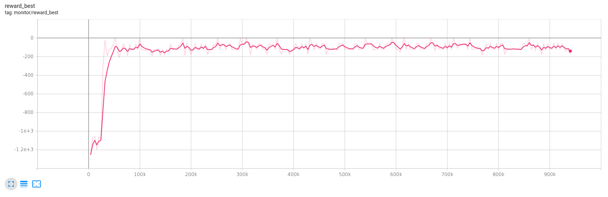
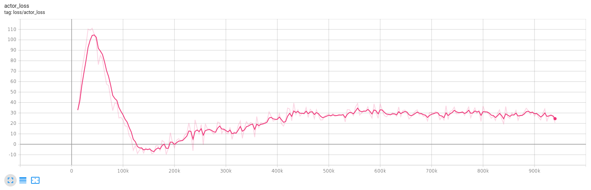
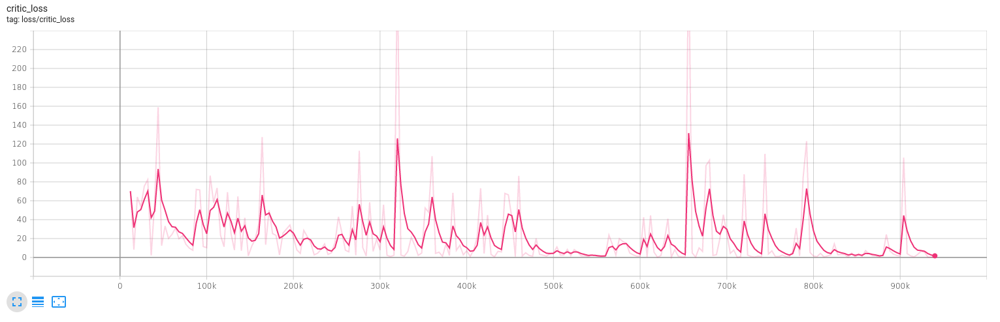
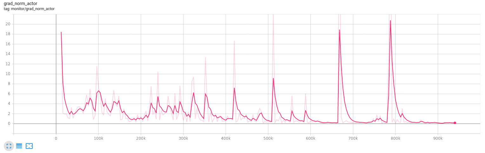
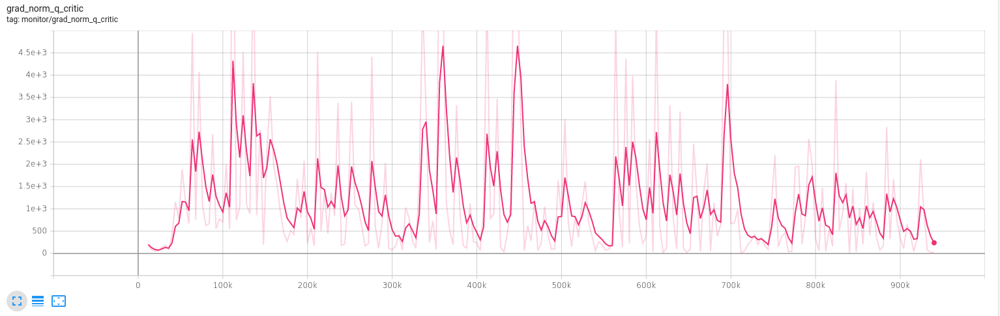
